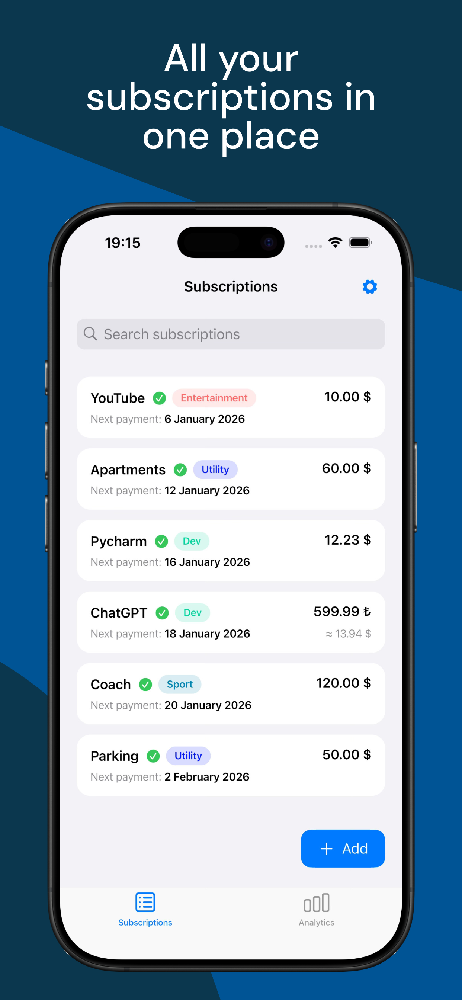
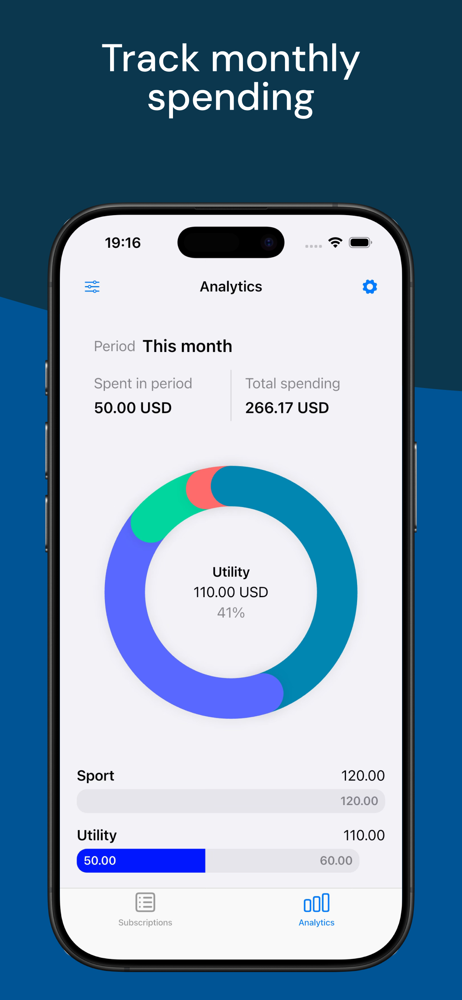
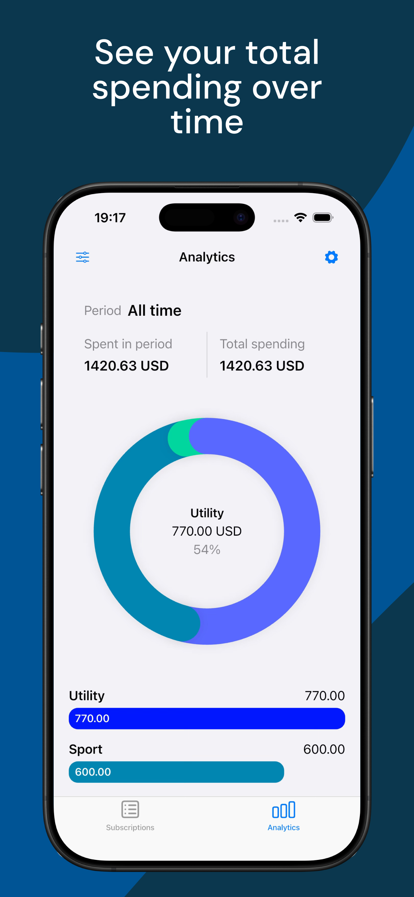

# Subctrl

<p align="center">
  <a href="https://github.com/gonfff/subctrl/actions/workflows/ci.yml">
    
  </a>
    <a href="https://img.shields.io/badge/platform-iOS-lightgrey">
    
  </a>
    </a>
    <a href="https://img.shields.io/badge/Dart-%5E3.10.3-blue?logo=dart">
    =3.10">
  </a>
  <a href="https://img.shields.io/badge/license-MIT-green.svg">
    
  </a>
</p>

Dead-simple subscription tracker for iOS, built with Flutter/Cupertino widgets.
Subctrl keeps tabs on recurring costs, converts currencies automatically, and
sends optional local reminders before renewals hit.

## Features

- Track subscriptions with local storage backed by Drift (`subctrl.db`).
- Automatic currency conversion via a proxy rates service with historical seeds to keep analytics stable offline.
- Analytics tabs for monthly burn, category totals, and long-term spend trends.
- Local, timezone-aware notifications driven by `LocalNotificationsService`.
- Clean Architecture split into presentation, application, domain, and
  infrastructure layers.
- Enforced code coverage (70%+) through the GitHub Actions workflow.

## Screenshots

<p align="center">
  
  
  
</p>

## Getting Started

1. **Prereqs**: Flutter 3.38.5 (matches CI), Dart SDK ^3.10.3, Xcode for iOS
   simulator/device builds.
2. **Install deps**:
   ```bash
   flutter pub get
   ```
3. **Run the app**:
   ```bash
   flutter run
   ```
4. **Configure notifications** (optional): ensure the iOS simulator/device has
   notification permissions enabled so local reminders can fire.

## License

MIT © Denis Dementev
